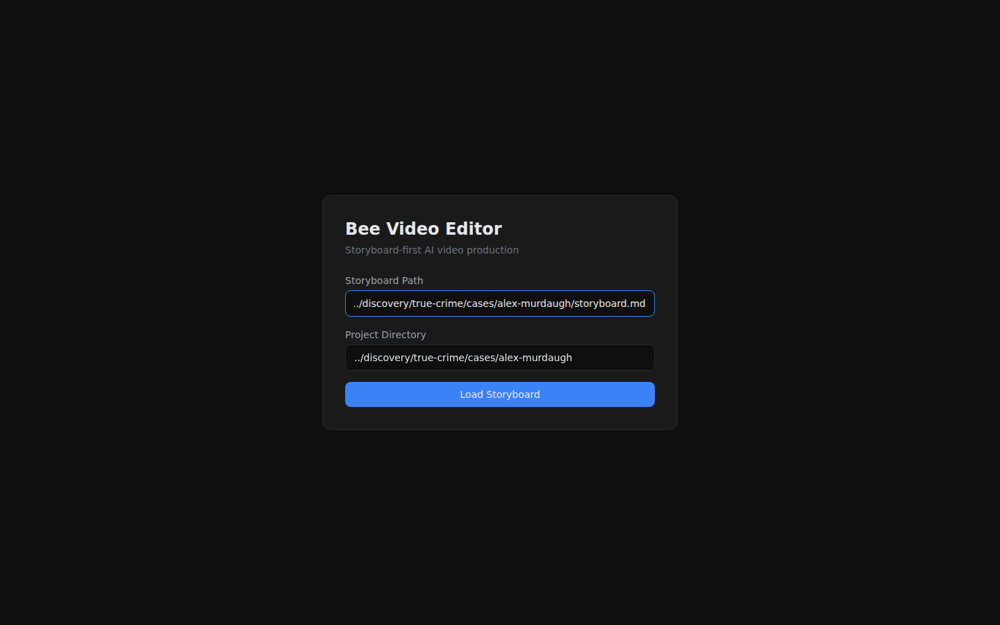
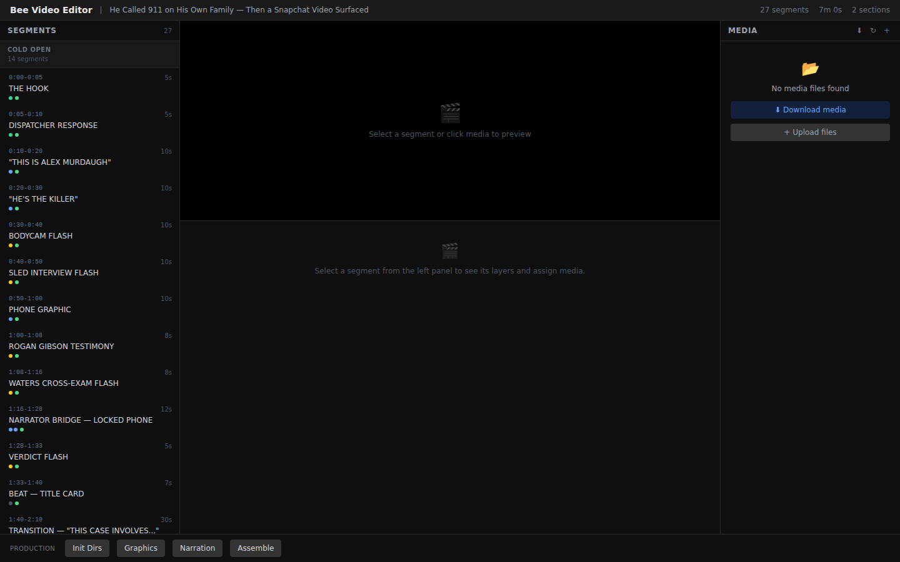

# bee-video-editor

AI-assisted video production tool. Takes a v2 storyboard markdown file and produces final videos through CLI commands, a web UI, or the Python API. v0.9.0.

## Quick Start

```bash
cd bee-content/video-editor

# Load a storyboard into a project
uv run bee-video import-md storyboard.md --project-dir ./my-project

# Detect shot boundaries in source footage
uv run bee-video scenes source.mp4 -p ./my-project

# Generate assets
uv run bee-video graphics storyboard.md -p ./my-project
uv run bee-video narration storyboard.md -p ./my-project --tts edge
uv run bee-video trim-footage storyboard.md -p ./my-project

# Assemble final video
uv run bee-video assemble -p ./my-project
uv run bee-video assemble -p ./my-project --transition fade --transition-duration 1.0

# Or run the full pipeline at once
uv run bee-video produce storyboard.md -p ./my-project --tts edge

# Export for NLE (DaVinci Resolve / Premiere)
uv run bee-video export -p ./my-project --format otio
uv run bee-video export -p ./my-project --format md

# Other utilities
uv run bee-video graphics-batch graphics.json -p ./my-project
uv run bee-video voice-lock elevenlabs --voice Daniel -p ./my-project
uv run bee-video rough-cut storyboard.md -p ./my-project

# Launch web editor
uv run bee-video serve --dev

# Render final video via Remotion (pixel-perfect MP4 with all overlays)
node web/render.mjs
```

## Effects & Transitions

### Apply effects to a clip

```bash
# Color grade
uv run bee-video effects input.mp4 output.mp4 --color noir

# Speed change (0.25x to 4x+)
uv run bee-video effects input.mp4 output.mp4 --speed 1.5

# Burn text with background box, shown between 2s and 8s
uv run bee-video effects input.mp4 output.mp4 --text "Breaking News" --text-pos bottom --text-start 2 --text-end 8

# Fade in/out
uv run bee-video effects input.mp4 output.mp4 --fade

# Combine multiple effects in one pass
uv run bee-video effects input.mp4 output.mp4 --color dark_crime --speed 1.2 --text "Chapter 1" --fade
```

### Transitions between clips

```bash
# Apply xfade transition between two clips
uv run bee-video transition clip_a.mp4 clip_b.mp4 output.mp4 --name dissolve --duration 1.5
```

### List all available effects

```bash
uv run bee-video list-effects
```

### Color Grade Presets

| Preset | Description |
|--------|-------------|
| `dark_crime` | Desaturated, cool blue shadows, higher contrast |
| `warm_victim` | Warm golden tones, gentle |
| `bodycam` | Slightly desaturated, cool tones |
| `noir` | Black & white, high contrast S-curve |
| `sepia` | Classic sepia tone via color channel mixing |
| `cold_blue` | Cold blue cast, slightly desaturated |
| `vintage` | Warm highlights, faded blues, lower contrast |
| `bleach_bypass` | Very desaturated, high contrast |
| `night_vision` | Green-tinted monochrome, bright |
| `golden_hour` | Warm golden tones, boosted saturation |
| `surveillance` | Desaturated with film noise |
| `vhs` | Oversaturated, warm red shift, low contrast |

### xfade Transitions

30+ built-in transitions: `fade`, `fadeblack`, `fadewhite`, `dissolve`, `wipeleft`, `wiperight`, `wipeup`, `wipedown`, `slideleft`, `slideright`, `slideup`, `slidedown`, `smoothleft`, `smoothright`, `circlecrop`, `rectcrop`, `distance`, `radial`, `diagtl`, `diagtr`, `diagbl`, `diagbr`, `hlslice`, `hrslice`, `vuslice`, `vdslice`, `pixelize`, `hblur`, `zoomin`.

### Ken Burns Effects

For `image_to_video` and image-based segments:

| Effect | Description |
|--------|-------------|
| `zoom_in` | Slow zoom into center |
| `zoom_out` | Start zoomed, pull back |
| `pan_left` | Pan from right to left |
| `pan_right` | Pan from left to right |
| `pan_up` | Pan from bottom to top |
| `pan_down` | Pan from top to bottom |
| `zoom_in_pan_right` | Zoom in while panning right |

## Production Pipeline

The full pipeline for producing a video from a v2 storyboard:

```
1. import-md   → Load storyboard markdown → OTIO project file
2. init        → Create output directories and production state
3. graphics    → Generate lower thirds, timeline markers, quote/financial cards
4. narration   → Generate TTS narration (edge / kokoro / openai / elevenlabs)
5. trim        → Trim source footage per storyboard notes
6. composite   → Per-segment: visual → normalize → color grade → overlay → audio → mux
7. assemble    → Concatenate composited segments into final video (with optional transitions)
```

Or run everything at once:

```bash
uv run bee-video produce storyboard.md -p ./my-project --tts edge
```

### Scene Detection

Detect shot boundaries in source footage before editing:

```bash
uv run bee-video scenes source_footage.mp4 -p ./my-project
# Outputs a JSON list of detected scenes with start/end/duration
```

### Batch Graphics

Generate all graphics from a JSON config file instead of one CLI call per graphic:

```bash
uv run bee-video graphics-batch graphics.json -p ./my-project
```

Config format:
```json
{
  "output_dir": "output/graphics",
  "graphics": [
    {"type": "lower_third", "name": "Alex Murdaugh", "role": "Defendant"},
    {"type": "timeline_marker", "date": "June 7, 2021", "description": "Night of the murders"},
    {"type": "financial_card", "amount": "$10.5 million", "description": "Misappropriated funds"},
    {"type": "quote_card", "quote": "I did him so bad.", "speaker": "Alex Murdaugh", "accent": "red"},
    {"type": "text_overlay", "text": "Chapter 1: The Family", "position": "center"},
    {"type": "black_frame"}
  ]
}
```

Supported types: `lower_third`, `timeline_marker`, `quote_card`, `financial_card`, `text_overlay`, `black_frame`, `mugshot_card`, `news_montage`.

### Voice Lock

Lock TTS engine and voice per project so narration stays consistent across sessions:

```bash
# Lock voice for this project
uv run bee-video voice-lock elevenlabs --voice Daniel -p ./my-project

# Subsequent narration commands auto-use the locked voice
uv run bee-video narration guide.md -p ./my-project  # uses elevenlabs/Daniel
uv run bee-video narration guide.md -p ./my-project --tts openai  # overrides lock
```

### Rough Cut

Export a fast 720p rough cut for structure review before investing in full assembly:

```bash
uv run bee-video rough-cut storyboard.md -p ./my-project
```

No color grading, no transitions — just 720p normalize + concat. Output at `output/rough/rough_cut.mp4`.

## Stock Footage (Pexels)

Search and download stock footage directly from the CLI:

```bash
# Set your API key (free at pexels.com/api)
export PEXELS_API_KEY=your-key-here

# Search and download 3 clips (min 5s each)
uv run bee-video fetch-stock "aerial farm dusk" -n 3 -p ./my-project

# Landscape only, longer clips
uv run bee-video fetch-stock "courtroom interior" -n 5 --duration 10 --orientation landscape -p ./my-project
```

Downloads go to `stock/` with Pexels-attributed filenames.

## AI Video Generation

Generate video clips from text prompts using pluggable AI providers:

```bash
# Stub provider (for testing — generates real placeholder MP4 via FFmpeg)
uv run bee-video generate-clip "aerial shot of farm at dusk" -p ./my-project

# With a real provider
uv run bee-video generate-clip "dramatic courtroom scene" --provider kling -p ./my-project

# With reference images
uv run bee-video generate-clip "match this style" --reference photo.jpg --provider veo -p ./my-project
```

Available providers:
| Provider | Status | Notes |
|----------|--------|-------|
| `stub` | Built-in | Generates real placeholder MP4 via FFmpeg |
| `kling` | Stub (API pending) | Needs `KLING_API_KEY` |
| `veo` | Stub (API pending) | Needs Google Cloud credentials |
| `runway` | Planned | `pip install runwayml` |

Output goes to `generated/` directory and appears in the media library.

## Project Validation

Check your project structure and naming conventions:

```bash
uv run bee-video validate -p ./my-project
```

Reports missing directories, invalid sidecar JSON, filenames with spaces or uppercase. Issues are categorized as errors (broken structure), warnings (naming issues), or info (suggestions).

## Stock Footage Library

Track which stock clips you've used across projects to avoid repetition:

```bash
# List all tracked clips
uv run bee-video stock-list

# Check if a query has been used before
uv run bee-video stock-check "aerial farm"
```

Clips are auto-registered when downloaded via `fetch-stock`. The library lives at `~/.bee-video/stock-library.db`.

## Web Editor

### Helper Scripts

The easiest way to run the editor:

```bash
# Development mode — starts backend + Vite frontend with hot reload
./dev.sh

# Production mode — builds frontend (if needed) and serves everything
./start.sh

# Force rebuild frontend before starting
BUILD=1 ./start.sh
```

Both scripts auto-detect open ports and kill previous instances. Default ports: backend `:8420`, frontend `:5173` (dev mode).

Environment variables:
- `BACKEND_PORT` — override backend port (dev mode, default `8420`)
- `FRONTEND_PORT` — override frontend port (dev mode, default `5173`)
- `PORT` — override server port (production mode, default `8420`)
- `BUILD` — set to `1` to force frontend rebuild (production mode)

### Manual startup

```bash
# Development mode (frontend hot reload via Vite)
uv run bee-video serve --dev
# Then in another terminal:
cd web && npm run dev

# Production mode (serves built frontend)
cd web && npm run build
uv run bee-video serve
```

The web UI features a full NLE timeline (DesignCombo SDK, V1/A1/A2/A3/OV1 tracks), Remotion Player for composited video preview with real-time overlay rendering, a tabbed right sidebar (Media / Properties / AI), drag-and-drop media assignment, stock footage search, clip property editing (color grade, volume, trim, transitions), JKL shuttle playback, split at playhead (S key), and pipeline actions via the production dropdown.

### Screenshots

Screenshots are maintained in `docs/screenshots/latest/` and updated each release. See [Screenshot Checklist](docs/SCREENSHOT-CHECKLIST.md) for the capture process.





## Python API

All processors are importable for scripting:

```python
from bee_video_editor.processors.ffmpeg import (
    color_grade, xfade, drawtext, speed, picture_in_picture,
    concat_with_transitions, image_to_video, add_fade,
    COLOR_GRADE_PRESETS, XFADE_TRANSITIONS,
)

# Apply noir color grading
color_grade("input.mp4", "graded.mp4", preset="noir")

# Dissolve transition between two clips
xfade("clip_a.mp4", "clip_b.mp4", "transition.mp4", transition="dissolve", duration=1.5)

# Burn timed text
drawtext("input.mp4", "titled.mp4", text="Chapter 1", start=0, end=3, box=True)

# Speed ramp
speed("input.mp4", "fast.mp4", factor=2.0)

# Picture-in-picture
picture_in_picture("main.mp4", "pip.mp4", "output.mp4", pip_width=320)

# Ken Burns on an image
image_to_video("photo.jpg", "clip.mp4", duration=5.0, ken_burns="zoom_in_pan_right")

# Assemble with transitions
concat_with_transitions(
    ["seg1.mp4", "seg2.mp4", "seg3.mp4"],
    "final.mp4",
    transition="fadeblack",
    transition_duration=1.0,
)
```

## TTS Engines

| Engine | Cost | Notes |
|--------|------|-------|
| `edge` | Free | Microsoft Edge TTS, cloud-based, good quality |
| `kokoro` | Free | Local model, 24kHz output, requires `tts-kokoro` extra |
| `openai` | Paid | Best quality, requires API key and `tts-openai` extra |
| `elevenlabs` | Free tier / Paid | High quality, requires `ELEVENLABS_API_KEY` env var |

```bash
uv run bee-video narration guide.md --tts edge --voice en-US-GuyNeural
uv run bee-video narration guide.md --tts kokoro --voice am_adam
uv run bee-video narration guide.md --tts openai --voice onyx
uv run bee-video narration guide.md --tts elevenlabs --voice Daniel
```

Use `bee-video voice-lock` to persist your preferred engine/voice per project.

## Architecture

```
Adapters (CLI / FastAPI + React)
    │
Services (production, compositor, matcher, acquisition)
    │
┌───┴───┐
formats/    Processors
(OTIO)      ├ ffmpeg.py, graphics.py, tts.py
            ├ captions.py, maps.py
            ├ scene_detect.py, media_search.py
            └ ai_video.py
```

- **`formats/`**: `ParsedStoryboard` — the runtime model. Bidirectional `.md` ↔ OTIO conversion.
- **Processors**: Stateless functions wrapping FFmpeg, Pillow, TTS, stock APIs, scene detection.
- **Services**: Production pipeline orchestration (no business logic — calls processors, manages state).
- **Adapters**: Typer CLI, FastAPI + React web UI. Both delegate to the same service functions.

## Development

```bash
# Install with dev dependencies
uv sync --extra dev

# Run all tests (backend + frontend type check)
./test.sh

# Run backend tests only
uv run --extra dev pytest tests/ -v

# Run a specific test file
uv run --extra dev pytest tests/test_ffmpeg_effects.py -v
```

## Changelog

See [CHANGELOG.md](CHANGELOG.md) for release history and [ROADMAP.md](ROADMAP.md) for planned improvements.
